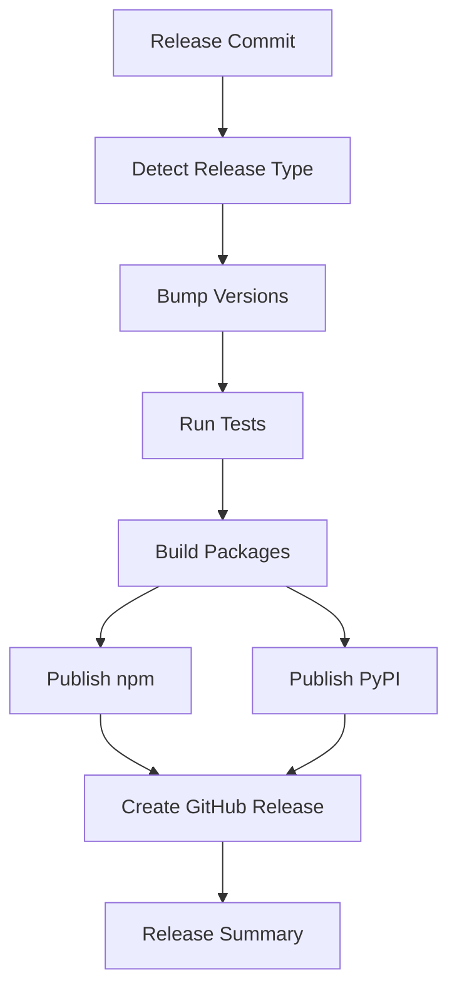

# 🤖 Release Automation Guide

This guide explains the automated release system for the Glin-Profanity monorepo.

## 🚀 Quick Release Commands

### Stable Releases
```bash
# Patch release (2.1.0 → 2.1.1)
git commit -m "release: patch fix critical security vulnerability" --allow-empty
git push origin main

# Minor release (2.1.0 → 2.2.0)  
git commit -m "release: minor add new language support" --allow-empty
git push origin main

# Major release (2.1.0 → 3.0.0)
git commit -m "release: major breaking API changes for v3" --allow-empty
git push origin main
```

### Beta Releases
```bash
# Beta patch (2.1.0 → 2.1.1-beta.1)
git commit -m "release: beta-patch experimental fix" --allow-empty
git push origin main

# Beta minor (2.1.0 → 2.2.0-beta.1)
git commit -m "release: beta-minor test new feature" --allow-empty
git push origin main

# Beta major (2.1.0 → 3.0.0-beta.1)
git commit -m "release: beta-major preview breaking changes" --allow-empty
git push origin main
```

### Alpha Releases
```bash
# Alpha releases for early development
git commit -m "release: alpha-patch early development fix" --allow-empty
git push origin main
```

## 🔧 Manual Release Tools

### npm Scripts
```bash
# Version management
npm run version:status          # Check current versions
npm run version:sync           # Sync Python to JavaScript version
npm run version:sync 1.2.3     # Set both to specific version

# Local releases (updates versions only)
npm run release:patch          # Stable patch
npm run release:minor          # Stable minor
npm run release:major          # Stable major
npm run release:beta           # Beta minor
npm run release:beta-patch     # Beta patch
npm run release:alpha          # Alpha minor

# Auto-detect from last commit
npm run release:auto
```

### Direct Script Usage
```bash
# Status and sync
node scripts/sync-versions.js status
node scripts/sync-versions.js sync
node scripts/sync-versions.js sync 1.2.3

# Manual releases
node scripts/sync-versions.js release patch stable
node scripts/sync-versions.js release minor beta
node scripts/sync-versions.js release major alpha

# Auto-release from commit message
node scripts/sync-versions.js auto
```

## 🔄 Automation Flow

### 1. Commit Detection
The system detects release commits using these patterns:

| Pattern | Release Type | Channel | Example |
|---------|-------------|---------|---------|
| `release: patch` | patch | stable | `release: patch fix memory leak` |
| `release: minor` | minor | stable | `release: minor add React hooks` |
| `release: major` | major | stable | `release: major breaking API changes` |
| `release: beta-patch` | patch | beta | `release: beta-patch experimental fix` |
| `release: beta-minor` | minor | beta | `release: beta-minor test new feature` |
| `release: alpha-*` | * | alpha | `release: alpha-minor early prototype` |

### 2. Version Bumping
- **Automatic**: Follows semantic versioning rules
- **Synchronized**: Both JavaScript and Python packages get the same version
- **Tagged**: Proper npm/PyPI distribution tags applied

### 3. Publishing Pipeline



### 4. Distribution Channels

| Channel | npm Tag | PyPI Status | Use Case |
|---------|---------|-------------|----------|
| **stable** | `latest` | `Production/Stable` | Production use |
| **beta** | `beta` | `4 - Beta` | Pre-release testing |
| **alpha** | `alpha` | `3 - Alpha` | Development testing |

## 📦 Installation Commands

### For Users

**Stable (Recommended):**
```bash
# JavaScript
npm install glin-profanity

# Python  
pip install glin-profanity
```

**Beta Testing:**
```bash
# JavaScript
npm install glin-profanity@beta

# Python
pip install glin-profanity --pre
```

**Alpha Development:**
```bash
# JavaScript
npm install glin-profanity@alpha

# Python
pip install glin-profanity --pre
```

## 🛡️ Safety Features

### Automated Checks
- ✅ Cross-language test parity
- ✅ Version synchronization validation
- ✅ Build verification before publishing
- ✅ Rollback capabilities
- ✅ Non-blocking quality checks (formatting, linting)

### Emergency Procedures
```bash
# Skip CI for urgent commits
git commit -m "fix: urgent security patch [skip ci]"

# Manual workflow trigger (emergency)
gh workflow run auto-release.yml -f release_type=patch -f channel=stable -f skip_tests=true
```

### Rollback Process
```bash
# Unpublish from npm (within 24 hours)
npm unpublish glin-profanity@1.2.3

# Delete git tag
git tag -d v1.2.3
git push origin :refs/tags/v1.2.3

# Revert commit
git revert HEAD
```

## 🔍 Monitoring & Debugging

### Check Release Status
```bash
# View GitHub Actions
gh run list --workflow=auto-release.yml

# Check last release
gh release view --json tagName,publishedAt,assets

# Verify package publications
npm view glin-profanity versions --json
pip index versions glin-profanity
```

### Common Issues

| Issue | Solution |
|-------|----------|
| Version mismatch | Run `npm run version:sync` |
| Failed npm publish | Check `NPM_TOKEN` secret |
| Failed PyPI publish | Check `PYPI_TOKEN` secret |
| Tests failing | Fix tests before release commit |
| CI not triggered | Check commit message format |

## 📊 Release Schedule

### Recommended Cadence
- **Patch**: As needed (security, critical bugs)
- **Minor**: Every 2 weeks (new features)
- **Major**: Every quarter (breaking changes)
- **Beta**: 1 week before minor/major
- **Alpha**: Daily (for development)

### Release Calendar
```bash
# View upcoming releases
gh issue list --label="release" --state=open

# Plan next release
gh issue create --title="Release v2.2.0" --label="release" --body="..."
```

## 🤝 Contributing to Releases

### For Maintainers
1. Use conventional commit messages
2. Test in both JavaScript and Python
3. Update documentation if needed
4. Use proper release commit format
5. Monitor release pipeline

### For Contributors
1. Focus on feature development
2. Don't use release commit patterns
3. Ensure cross-language compatibility
4. Add tests for new features
5. Update documentation

## 📞 Support

### Troubleshooting
- 📚 [Release Guide](./RELEASE.md)
- 🐛 [GitHub Issues](https://github.com/GLINCKER/glin-profanity/issues)
- 💬 [Discussions](https://github.com/GLINCKER/glin-profanity/discussions)

### Team Contacts
- **Release Manager**: @gdsks
- **CI/CD Issues**: Create GitHub issue with `ci` label
- **Emergency**: Email [hello@glincker.com](mailto:hello@glincker.com)

---

*Automation system last updated: $(date +'%Y-%m-%d')*

> 🤖 **Tip**: Use `npm run version:status` frequently to check synchronization!