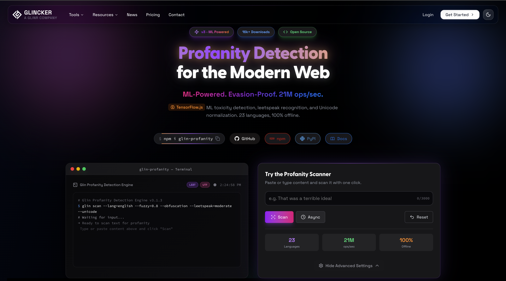
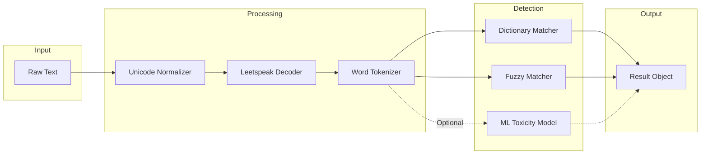

<h1 align="center">GLIN PROFANITY</h1>

<p align="center">
  <strong>ML-Powered Profanity Detection for the Modern Web</strong>
</p>

<!-- Badges Row 1: Package Info -->
<p align="center">
  <a href="https://www.npmjs.com/package/glin-profanity"></a>
  <a href="https://pypi.org/project/glin-profanity/"></a>
  <a href="https://www.npmjs.com/package/glin-profanity"></a>
  <a href="https://pepy.tech/projects/glin-profanity"></a>
</p>

<!-- Badges Row 2: Quality & Status -->
<p align="center">
  <a href="https://github.com/GLINCKER/glin-profanity/actions/workflows/ci.yml"></a>
  <a href="https://bundlephobia.com/package/glin-profanity"></a>
  <a href="https://github.com/GLINCKER/glin-profanity/blob/main/LICENSE"></a>
  <a href="https://www.typescriptlang.org/"></a>
</p>

<!-- Badges Row 3: Community -->
<p align="center">
  <a href="https://github.com/GLINCKER/glin-profanity/stargazers"></a>
  <a href="https://github.com/GLINCKER/glin-profanity/network/members"></a>
  <a href="https://github.com/GLINCKER/glin-profanity/issues"></a>
  <a href="https://github.com/GLINCKER/glin-profanity/graphs/contributors"></a>
</p>

<!-- Hero Image -->
<p align="center">
  <a href="https://www.glincker.com/tools/glin-profanity" target="_blank">
    
  </a>
</p>

<p align="center">
  <a href="https://www.glincker.com/tools/glin-profanity"></a>
</p>

---

## Why Glin Profanity?

Most profanity filters are trivially bypassed. Users type `f*ck`, `sh1t`, or `fսck` (with Cyrillic characters) and walk right through. Glin Profanity doesn't just check against a word list—it understands evasion tactics.

```
┌─────────────────────────────────────────────────────────────────────────────┐
│                           GLIN PROFANITY v3                                 │
├─────────────────────────────────────────────────────────────────────────────┤
│                                                                             │
│   Input Text ──►  Unicode       ──►  Leetspeak    ──►  Dictionary  ──► ML  │
│                   Normalization      Detection         Matching        Check│
│                   (homoglyphs)       (f4ck→fuck)       (23 langs)     (opt) │
│                                                                             │
│   "fսck"     ──►  "fuck"        ──►  "fuck"       ──►  MATCH       ──► ✓   │
│                                                                             │
└─────────────────────────────────────────────────────────────────────────────┘
```

---

## Performance Benchmarks

Tested on Node.js 20, M1 MacBook Pro, single-threaded:

| Operation | Glin Profanity | bad-words | leo-profanity | obscenity |
|-----------|----------------|-----------|---------------|-----------|
| Simple check | **21M ops/sec** | 890K ops/sec | 1.2M ops/sec | 650K ops/sec |
| With leetspeak | **8.5M ops/sec** | N/A | N/A | N/A |
| Multi-language (3) | **18M ops/sec** | N/A | 400K ops/sec | N/A |
| Unicode normalization | **15M ops/sec** | N/A | N/A | N/A |

---

## Feature Comparison

| Feature | Glin Profanity | bad-words | leo-profanity | obscenity |
|---------|----------------|-----------|---------------|-----------|
| Leetspeak detection (`f4ck`, `sh1t`) | Yes | No | No | Partial |
| Unicode homoglyph detection | Yes | No | No | No |
| ML toxicity detection | Yes (TensorFlow.js) | No | No | No |
| Multi-language support | 23 languages | English only | 14 languages | English only |
| Result caching (LRU) | Yes | No | No | No |
| Severity levels | Yes | No | No | No |
| React hook | Yes | No | No | No |
| Python package | Yes | No | No | No |
| TypeScript types | Full | Partial | Partial | Full |
| Bundle size (minified) | 12KB + dictionaries | 8KB | 15KB | 6KB |
| Active maintenance | Yes | Limited | Limited | Limited |

---

## Installation

**JavaScript/TypeScript**
```bash
npm install glin-profanity
```

**Python**
```bash
pip install glin-profanity
```

---

## Quick Start

**JavaScript**
```javascript
import { checkProfanity, Filter } from 'glin-profanity';

// Simple check
const result = checkProfanity("This is f4ck1ng bad", {
  detectLeetspeak: true,
  languages: ['english']
});

result.containsProfanity  // true
result.profaneWords       // ['fucking']

// With replacement
const filter = new Filter({
  replaceWith: '***',
  detectLeetspeak: true
});
filter.checkProfanity("sh1t happens").processedText  // "*** happens"
```

**Python**
```python
from glin_profanity import Filter

filter = Filter({"languages": ["english"], "replace_with": "***"})

filter.is_profane("damn this")           # True
filter.check_profanity("damn this")      # Full result object
```

**React**
```tsx
import { useProfanityChecker } from 'glin-profanity';

function ChatInput() {
  const { result, checkText } = useProfanityChecker({
    detectLeetspeak: true
  });

  return (
    <input onChange={(e) => checkText(e.target.value)} />
    {result?.containsProfanity && <span>Clean up your language</span>}
  );
}
```

---

## Architecture



---

## Detection Capabilities

### Leetspeak Detection

```javascript
const filter = new Filter({
  detectLeetspeak: true,
  leetspeakLevel: 'aggressive'  // basic | moderate | aggressive
});

filter.isProfane('f4ck');     // true
filter.isProfane('5h1t');     // true
filter.isProfane('@$$');      // true
filter.isProfane('ph.u" "ck'); // true (aggressive mode)
```

### Unicode Homoglyph Detection

```javascript
const filter = new Filter({ normalizeUnicode: true });

filter.isProfane('fսck');   // true (Armenian 'ս' → 'u')
filter.isProfane('shіt');   // true (Cyrillic 'і' → 'i')
filter.isProfane('ƒuck');   // true (Latin 'ƒ' → 'f')
```

### ML-Powered Detection

```javascript
import { loadToxicityModel, checkToxicity } from 'glin-profanity/ml';

await loadToxicityModel({ threshold: 0.9 });

const result = await checkToxicity("You're the worst player ever");
// { toxic: true, categories: { toxicity: 0.92, insult: 0.87, ... } }
```

---

## Supported Languages

23 languages with curated dictionaries:

| | | | |
|---|---|---|---|
| Arabic | Chinese | Czech | Danish |
| Dutch | English | Esperanto | Finnish |
| French | German | Hindi | Hungarian |
| Italian | Japanese | Korean | Norwegian |
| Persian | Polish | Portuguese | Russian |
| Spanish | Swedish | Thai | Turkish |

---

## Documentation

| Document | Description |
|----------|-------------|
| [Getting Started](./docs/getting-started.md) | Installation and basic usage |
| [API Reference](./docs/api-reference.md) | Complete API documentation |
| [Framework Examples](./docs/framework-examples.md) | React, Vue, Angular, Express, Next.js |
| [Advanced Features](./docs/advanced-features.md) | Leetspeak, Unicode, ML, caching |
| [ML Guide](./docs/ML-GUIDE.md) | TensorFlow.js integration |
| [Changelog](./CHANGELOG.md) | Version history |

---

## Local Testing Interface

Run the interactive playground locally to test profanity detection:

```bash
# Clone the repo
git clone https://github.com/GLINCKER/glin-profanity.git
cd glin-profanity/packages/js

# Install dependencies
npm install

# Start the local testing server
npm run dev:playground
```

Open **http://localhost:4000** to access the testing interface with:
- Real-time profanity detection
- Toggle leetspeak, Unicode normalization, ML detection
- Multi-language selection
- Visual results with severity indicators

---

## Use Cases

| Application | How Glin Profanity Helps |
|-------------|-------------------------|
| Chat platforms | Real-time message filtering with React hook |
| Gaming | Detect obfuscated profanity in player names/chat |
| Social media | Scale moderation with ML-powered detection |
| Education | Maintain safe learning environments |
| Enterprise | Filter internal communications |
| AI/ML pipelines | Clean training data before model ingestion |

---

## License

MIT License - free for personal and commercial use.

Enterprise licensing with SLA and support available from [GLINCKER](https://glincker.com).

---

## Contributing

See [CONTRIBUTING.md](./CONTRIBUTING.md) for guidelines. We welcome:

- Bug reports and fixes
- New language dictionaries
- Performance improvements
- Documentation updates

---

## Star History

<a href="https://star-history.com/#GLINCKER/glin-profanity&Date">
 <picture>
   <source media="(prefers-color-scheme: dark)" srcset="https://api.star-history.com/svg?repos=GLINCKER/glin-profanity&type=Date&theme=dark" />
   <source media="(prefers-color-scheme: light)" srcset="https://api.star-history.com/svg?repos=GLINCKER/glin-profanity&type=Date" />
   
 </picture>
</a>

---

<div align="center">

**[Live Demo](https://www.glincker.com/tools/glin-profanity)** · **[NPM](https://www.npmjs.com/package/glin-profanity)** · **[PyPI](https://pypi.org/project/glin-profanity/)** · **[GitHub](https://github.com/GLINCKER/glin-profanity)**

<br />

<a href="https://github.com/GLINCKER/glin-profanity/stargazers">
  
</a>

<br /><br />

<sub>Built by <a href="https://glincker.com">GLINCKER</a> · Part of the <a href="https://github.com/GLINCKER">GLINR</a> ecosystem</sub>

</div>
