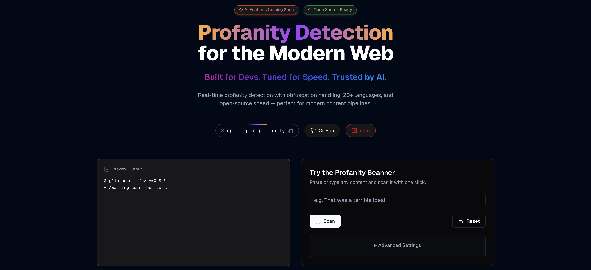

<p align="center">
  <a href="https://www.glincker.com/tools/glin-profanity" target="_blank">
     
  </a>
</p>

<h1 align="center">GLIN PROFANITY</h1>

<p align="center">
  <strong>A multilingual profanity detection and filtering engine for modern applications — by <a href="https://glincker.com">GLINCKER</a></strong>
</p>
<p align="center">
  <a href="https://www.glincker.com/tools/glin-profanity">
    
  </a>
</p>

<p align="center">
  <a href="https://www.npmjs.com/package/glin-profanity">
    
  </a>
  <a href="https://github.com/GLINCKER/glin-profanity/blob/main/LICENSE">
    
  </a>
  <a href="https://github.com/GLINCKER/glin-profanity/actions">
    
  </a>
  <a href="https://www.npmjs.com/package/glin-profanity">
    
  </a>
  <a href="https://github.com/GLINCKER/glin-profanity/issues">
    
  </a>
  <a href="https://github.com/GLINCKER/glin-profanity/pulls">
    
  </a>
  <a href="https://github.com/GLINCKER/glin-profanity/commits/main">
    
  </a>
  <a href="https://github.com/GLINCKER/glin-profanity/stargazers">
    
  </a>
  <a href="https://github.com/GLINCKER/glin-profanity/network/members">
    
  </a>
  <a href="https://github.com/GLINCKER/glin-profanity/graphs/contributors">
    
  </a>
  <a href="#-table-of-contents">
    
  </a>
</p>

---


> A multilingual profanity detection and filtering engine for modern applications — by [GLINCKER](https://glincker.com)
 
[](https://www.glincker.com/tools/glin-profanity)

---

## ✨ Overview

**Glin-Profanity** is a high-performance JavaScript/TypeScript library built to detect, filter, and sanitize profane or harmful language in user-generated content. With support for over 20+ languages, configurable severity levels, obfuscation detection, and framework-agnostic design, it's perfect for developers who care about building safe, inclusive platforms.

Whether you're moderating chat messages, community forums, or content input forms, Glin-Profanity empowers you to:

- 🧼 Filter text with real-time or batch processing
- 🗣️ Detect offensive terms in **20+ human languages**
- 💬 Catch obfuscated profanity like `sh1t`, `f*ck`, `a$$hole`
- 🎚️ Adjust severity thresholds (`Exact`, `Fuzzy`, `Merged`)
- 🔁 Replace bad words with symbols or emojis
- 🧩 Works in **any JavaScript environment** -     
- 🛡️ Add custom word lists or ignore specific terms

## 🚀 Key Features

<div align="center">
  
  
  
  
</div>

## 📚 Table of Contents

- [🚀 Key Features](#-key-features)
- [📦 Installation](#installation)
- [🌍 Supported Languages](#supported-languages)
- [⚙️ Usage](#usage)
  - [Basic Usage](#basic-usage)
  - [Framework Examples](#framework-examples)
- [🧠 API](#api)
  - [Core Functions](#core-functions)
  - [Filter Class](#filter-class)
    - [Constructor](#constructor)
    - [FilterConfig Options](#filterconfig-options)
    - [Methods](#methods)
      - [isProfane](#isprofane)
      - [checkProfanity](#checkprofanity)
  - [useProfanityChecker Hook](#useprofanitychecker-hook)
    - [Parameters](#parameters)
    - [Return Value](#return-value)
- [⚠️ Note](#note)
- [🛠 Use Cases](#-use-cases)
- [📄 License](#license)
  - [MIT License](#mit-license)

## Installation

<div align="center">
  
  
  
</div>

<br />

To install Glin-Profanity, use npm:

```bash
npm install glin-profanity
```
OR

```bash
yarn add glin-profanity
```
OR

```bash
pnpm add glin-profanity
```
 
## Supported Languages

Glin-Profanity includes comprehensive profanity dictionaries for **23 languages**:

🇸🇦 **Arabic** • 🇨🇳 **Chinese** • 🇨🇿 **Czech** • 🇩🇰 **Danish** • 🇬🇧 **English** • 🌍 **Esperanto** • 🇫🇮 **Finnish** • 🇫🇷 **French** • 🇩🇪 **German** • 🇮🇳 **Hindi** • 🇭🇺 **Hungarian** • 🇮🇹 **Italian** • 🇯🇵 **Japanese** • 🇰🇷 **Korean** • 🇳🇴 **Norwegian** • 🇮🇷 **Persian** • 🇵🇱 **Polish** • 🇵🇹 **Portuguese** • 🇷🇺 **Russian** • 🇪🇸 **Spanish** • 🇸🇪 **Swedish** • 🇹🇭 **Thai** • 🇹🇷 **Turkish**

> **Note**: The JavaScript and Python packages maintain cross-language parity, ensuring consistent profanity detection across both ecosystems.

## Usage

### Basic Usage

Glin-Profanity now provides framework-agnostic core functions alongside React-specific hooks:

#### 🟢 Node.js / Vanilla JavaScript

```javascript
const { checkProfanity } = require('glin-profanity');

const text = "This is some bad text with damn words";
const result = checkProfanity(text, {
  languages: ['english', 'spanish'],
  replaceWith: '***'
});

console.log(result.containsProfanity); // true
console.log(result.profaneWords);      // ['damn']
console.log(result.processedText);     // "This is some bad text with *** words"
```

#### 🔷 TypeScript

```typescript
import { checkProfanity, ProfanityCheckerConfig } from 'glin-profanity';

const config: ProfanityCheckerConfig = {
  languages: ['english', 'spanish'],
  severityLevels: true,
  autoReplace: true,
  replaceWith: '🤬'
};

const result = checkProfanity("inappropriate text", config);
```

### Framework Examples

<div align="center">
  
  
  
  
  
</div>

#### ⚛️ React

```tsx
import React, { useState } from 'react';
import { useProfanityChecker, SeverityLevel } from 'glin-profanity';

const App = () => {
  const [text, setText] = useState('');
  
  const { result, checkText } = useProfanityChecker({
    languages: ['english', 'spanish'],
    severityLevels: true,
    autoReplace: true,
    replaceWith: '***',
    minSeverity: SeverityLevel.EXACT
  });

  return (
    <div>
      <input value={text} onChange={(e) => setText(e.target.value)} />
      <button onClick={() => checkText(text)}>Scan</button>
      
      {result && result.containsProfanity && (
        <p>Cleaned: {result.processedText}</p>
      )}
    </div>
  );
};
```

#### 💚 Vue 3

```vue
<template>
  <div>
    <input v-model="text" @input="checkContent" />
    <p v-if="hasProfanity">{{ cleanedText }}</p>
  </div>
</template>

<script setup>
import { ref } from 'vue';
import { checkProfanity } from 'glin-profanity';

const text = ref('');
const hasProfanity = ref(false);
const cleanedText = ref('');

const checkContent = () => {
  const result = checkProfanity(text.value, {
    languages: ['english'],
    autoReplace: true,
    replaceWith: '***'
  });
  
  hasProfanity.value = result.containsProfanity;
  cleanedText.value = result.autoReplaced;
};
</script>
```

#### 🔴 Angular

```typescript
import { Component } from '@angular/core';
import { checkProfanity, ProfanityCheckResult } from 'glin-profanity';

@Component({
  selector: 'app-comment',
  template: `
    <textarea [(ngModel)]="comment" (ngModelChange)="validateComment()"></textarea>
    <div *ngIf="profanityResult?.containsProfanity" class="error">
      Please remove inappropriate language
    </div>
  `
})
export class CommentComponent {
  comment = '';
  profanityResult: ProfanityCheckResult | null = null;

  validateComment() {
    this.profanityResult = checkProfanity(this.comment, {
      languages: ['english', 'spanish'],
      severityLevels: true
    });
  }
}
```

#### 🚂 Express.js Middleware

```javascript
const express = require('express');
const { checkProfanity } = require('glin-profanity');

const profanityMiddleware = (req, res, next) => {
  const result = checkProfanity(req.body.message || '', {
    languages: ['english'],
    autoReplace: true,
    replaceWith: '[censored]'
  });
  
  if (result.containsProfanity) {
    req.body.message = result.autoReplaced;
  }
  
  next();
};

app.post('/comment', profanityMiddleware, (req, res) => {
  // Message is now sanitized
  res.json({ message: req.body.message });
});
```

## API

### 🎯 Core Functions

#### `checkProfanity`

Framework-agnostic function for profanity detection.

```typescript
checkProfanity(text: string, config?: ProfanityCheckerConfig): ProfanityCheckResult
```

#### `checkProfanityAsync`

Async version of checkProfanity.

```typescript
checkProfanityAsync(text: string, config?: ProfanityCheckerConfig): Promise<ProfanityCheckResult>
```

#### `isWordProfane`

Quick check if a single word is profane.

```typescript
isWordProfane(word: string, config?: ProfanityCheckerConfig): boolean
```

### 🔧 `Filter` Class

#### Constructor

```typescript
new Filter(config?: FilterConfig);
```

#### FilterConfig Options:

| Option                  | Type               | Description |
|-------------------------|--------------------|-------------|
| `languages`             | `Language[]`       | Languages to include (e.g., ['english', 'spanish']) |
| `allLanguages`          | `boolean`          | If true, scan all available languages |
| `caseSensitive`         | `boolean`          | Match case exactly |
| `wordBoundaries`        | `boolean`          | Only match full words (turn off for substring matching) |
| `customWords`           | `string[]`         | Add your own words |
| `replaceWith`           | `string`           | Replace matched words with this string |
| `severityLevels`        | `boolean`          | Enable severity mapping (Exact, Fuzzy, Merged) |
| `ignoreWords`           | `string[]`         | Words to skip even if found |
| `logProfanity`          | `boolean`          | Log results via console |
| `allowObfuscatedMatch`  | `boolean`          | Enable fuzzy pattern matching like `f*ck` |
| `fuzzyToleranceLevel`   | `number (0–1)`     | Adjust how tolerant fuzzy matching is |
| `autoReplace`           | `boolean`          | Whether to auto-replace flagged words |
| `minSeverity`           | `SeverityLevel`    | Minimum severity to include in final list |
| `customActions`         | `(result) => void` | Custom logging/callback support |

---

#### Methods

##### `isProfane`

Checks if a given text contains profanities.

```typescript
isProfane(value: string): boolean;
```

- `value`: The text to check.
- Returns: `boolean` - `true` if the text contains profanities, `false` otherwise.

##### `checkProfanity`

Returns details about profanities found in the text.

```typescript
checkProfanity(text: string): CheckProfanityResult;
```

- `text`: The text to check.
- Returns: `CheckProfanityResult`
  - `containsProfanity`: `boolean` - `true` if the text contains profanities, `false` otherwise.
  - `profaneWords`: `string[]` - An array of profane words found in the text.
  - `processedText`: `string` - The text with profane words replaced (if `replaceWith` is specified).
  - `severityMap`: `{ [word: string]: number }` - A map of profane words to their severity levels (if `severityLevels` is specified).

### ⚛️ `useProfanityChecker` Hook

A custom React hook for using the profanity checker.

#### Parameters

- `config`: An optional configuration object (same as ProfanityCheckerConfig).

#### Return Value

- `result`: The result of the profanity check.
- `checkText`: A function to check a given text for profanities.
- `checkTextAsync`: A function to check a given text for profanities asynchronously.
- `reset`: A function to reset the result state.
- `isDirty`: Boolean indicating if profanity was found.
- `isWordProfane`: Function to check if a single word is profane.

```typescript
const { result, checkText, checkTextAsync, reset, isDirty, isWordProfane } = useProfanityChecker(config);
```

## Note 
⚠️ Glin-Profanity is a best-effort tool. Language evolves, and no filter is perfect. Always supplement with human moderation for high-risk platforms.

## 🛠 Use Cases

- 🔐 Chat moderation in messaging apps
- 🧼 Comment sanitization for blogs or forums
- 🕹️ Game lobbies & multiplayer chats
- 🤖 AI content filters before processing input


## License

This software is also available under the GLINCKER LLC proprietary license. The proprietary license allows for use, modification, and distribution of the software with certain restrictions and conditions as set forth by GLINCKER LLC.

You are free to use this software for reference and educational purposes. However, any commercial use, distribution, or modification outside the terms of the MIT License requires explicit permission from GLINCKER LLC. 

By using the software in any form, you agree to adhere to the terms of both the MIT License and the GLINCKER LLC proprietary license, where applicable. If there is any conflict between the terms of the MIT License and the GLINCKER LLC proprietary license, the terms of the GLINCKER LLC proprietary license shall prevail.

### MIT License

GLIN PROFANITY is [MIT licensed](./LICENSE).